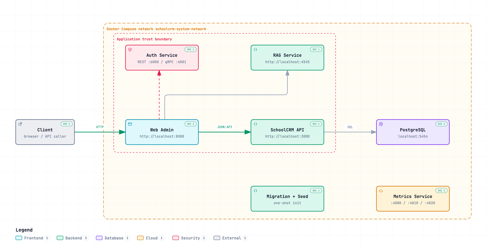

<a id="readme-top"></a>

# SchoolCRM

SchoolCRM is a service-oriented school operations platform with Go APIs, an Angular administration portal, PostgreSQL persistence, authentication, metrics, and a Python RAG service.

[](https://go.dev/)
[](https://angular.dev/)
[](https://www.postgresql.org/)
[](https://docs.docker.com/compose/)

## Table of Contents

- [About the project](#about-the-project)
- [Repository layout](#repository-layout)
- [Getting started](#getting-started)
  - [Prerequisites](#prerequisites)
  - [First-time setup](#first-time-setup)
  - [Run the complete local stack](#run-the-complete-local-stack)
- [Local development](#local-development)
  - [KIND/Kubernetes workflow](#kindkubernetes-workflow)
  - [Host-process workflow](#host-process-workflow)
  - [Run checks before a pull request](#run-checks-before-a-pull-request)
- [Local service endpoints](#local-service-endpoints)
- [Default users](#default-users)
- [Documentation](#documentation)
- [Contributing](#contributing)
- [License](#license)

## About the project

The repository contains the core APIs and the web administration application for school workflows. The backend uses layered Go services under `api/services`, shared infrastructure under `foundation`, and application/domain adapters under `app` and `business`. The RAG service is a separate FastAPI application with ports-and-adapters boundaries.

The local stack is defined in [`zarf/compose/docker_compose.yaml`](zarf/compose/docker_compose.yaml). Start with the [runtime architecture diagram](docs/diagrams/schoolcrm-runtime-architecture.html) to understand service boundaries and the [commit-to-production workflow](docs/diagrams/schoolcrm-commit-to-production.workflow.html) to understand delivery gates. Their Archify source files live beside the rendered HTML.

## Repository layout

```text
api/services/              Go services and the Python RAG service
api/frontends/web-admin/   Angular administration portal
api/tooling/               Development and operational tooling
app/                       Transport and application adapters
business/                  Domain logic and persistence support
foundation/                Shared infrastructure primitives
zarf/compose/              Local Docker Compose stack
docs/                      Architecture and developer documentation
```

## Getting started

### Prerequisites

- Go 1.26 or newer
- Docker and Docker Compose
- Node.js and npm compatible with Angular 21 for the Angular admin application
- Python 3.12 or newer for standalone RAG development
- `uv` for the RAG development environment (recommended)

### First-time setup

From the repository root:

```bash
npm install
npm --prefix api/frontends/web-admin ci
cd api/services/RAG && uv sync --extra dev && cd ../../..
```

Keep Docker Desktop running before starting the Compose stack. The repository's Docker
workflow is the shortest path to a working local environment.

### Run the complete local stack

```bash
make compose-build-up
```

Open the web admin at <http://localhost:8080>. Verify the APIs before using the UI:

```bash
curl --fail http://localhost:3000/v1/liveness
curl --fail http://localhost:6000/v1/liveness
curl --fail http://localhost:4545/v1/liveness
```

Stop only the Compose stack with:

```bash
make compose-down
```

## Local development

Choose one workflow at a time. Stop Compose before using host-process or KIND targets.

### KIND/Kubernetes workflow

```bash
make dev-up
make dev-update-apply
make dev-status
```

### Host-process workflow

Inspect available targets, then run each long-lived service in its own terminal:

```bash
make local-run-help
make local-seed
make local-auth
make local-schoolcrm
make local-rag
make local-web-admin
```

The Angular server uses port `4400` in this workflow; the Compose web admin uses port `8080`.
The detailed runbook is in [`docs/local-development.md`](docs/local-development.md).

Stop the active workflow with the matching command:

```bash
make compose-down  # Docker Compose
make dev-down      # KIND/Kubernetes
```

### Run checks before a pull request

```bash
make test                 # Go tests, vet, Staticcheck, and vulnerability checks
npm run lint:frontend     # Angular build validation
npm run test:frontend     # Angular unit tests
npm run lint:rag          # Ruff and Python compile checks
npm run test:rag          # RAG pytest suite
```

For faster standalone RAG checks after `uv sync --extra dev`:

```bash
cd api/services/RAG
uv run ruff check .
uv run pytest tests
```

## Local service endpoints



The diagram shows every published endpoint, the primary request path from the client to PostgreSQL, the application trust boundary, and the host-to-container port mapping. Open the [interactive diagram](docs/diagrams/schoolcrm-local-endpoints.html) for guided views of the request path, identity, and operations.

The Compose RAG container listens on port `7000` internally and is published as `4545` on the host. PostgreSQL uses `postgres` as the local development password unless overridden.

## Default users

Seed data creates these local development accounts. All use the password `gophers`.

| Email | Role |
| --- | --- |
| `superadmin@example.com` | `SUPER_ADMIN` |
| `admin@example.com` | `SCHOOL_ADMIN` |
| `teacher@example.com` | `TEACHER` |
| `user@example.com` | `STUDENT` |

Example login:

```bash
curl -i -X POST http://localhost:6000/v1/auth/login \
  -H 'Content-Type: application/json' \
  -d '{"email":"superadmin@example.com","password":"gophers"}'
```

## Documentation

- [`docs/local-development.md`](docs/local-development.md) — local setup and service runbook
- [`docs/diagrams/schoolcrm-local-endpoints.html`](docs/diagrams/schoolcrm-local-endpoints.html) — local service endpoint and port map
- [`docs/diagrams/schoolcrm-runtime-architecture.html`](docs/diagrams/schoolcrm-runtime-architecture.html) — runtime service architecture visualization
- [`docs/diagrams/schoolcrm-commit-to-production.workflow.html`](docs/diagrams/schoolcrm-commit-to-production.workflow.html) — commit-to-production workflow and gates
- [`docs/diagrams/schoolcrm-local-architecture.html`](docs/diagrams/schoolcrm-local-architecture.html) — legacy local topology reference
- [`api/frontends/web-admin/README.md`](api/frontends/web-admin/README.md) — Angular development commands
- [`api/services/RAG/README.md`](api/services/RAG/README.md) — RAG architecture and standalone run instructions

## Contributing

1. Create a focused branch from the current development branch.
2. Run the relevant tests and checks before opening a pull request.
3. Document changes to service contracts, ports, migrations, or local workflows.
4. Open a pull request with a concise description and verification notes.

## License

See [`LICENSE`](LICENSE).

[Back to top](#readme-top)
