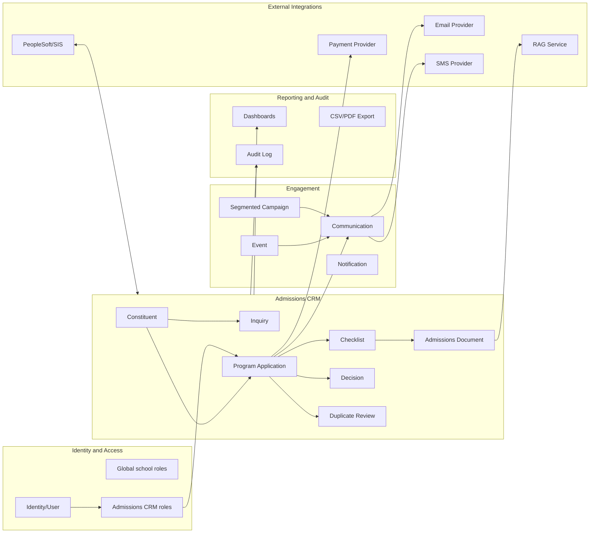
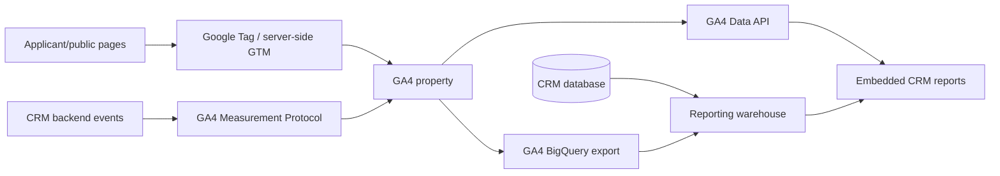
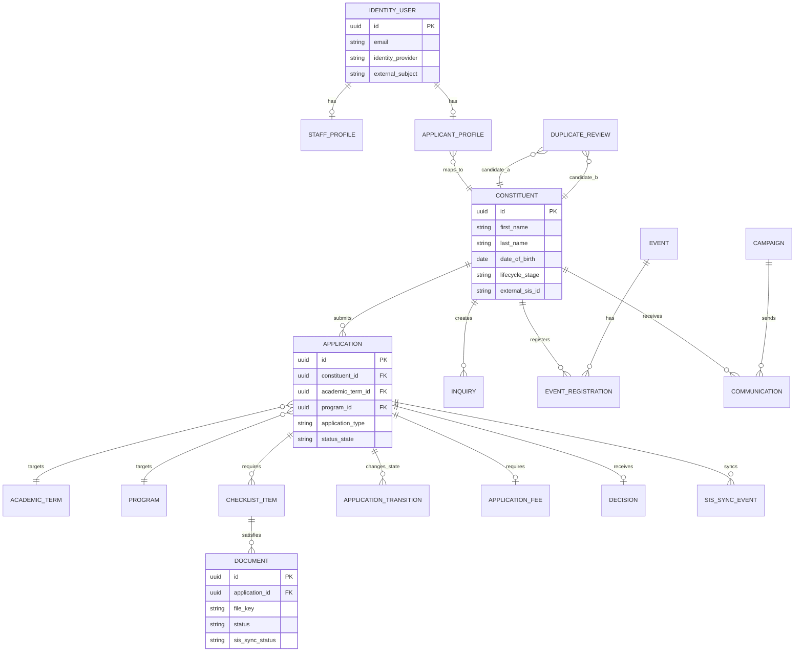
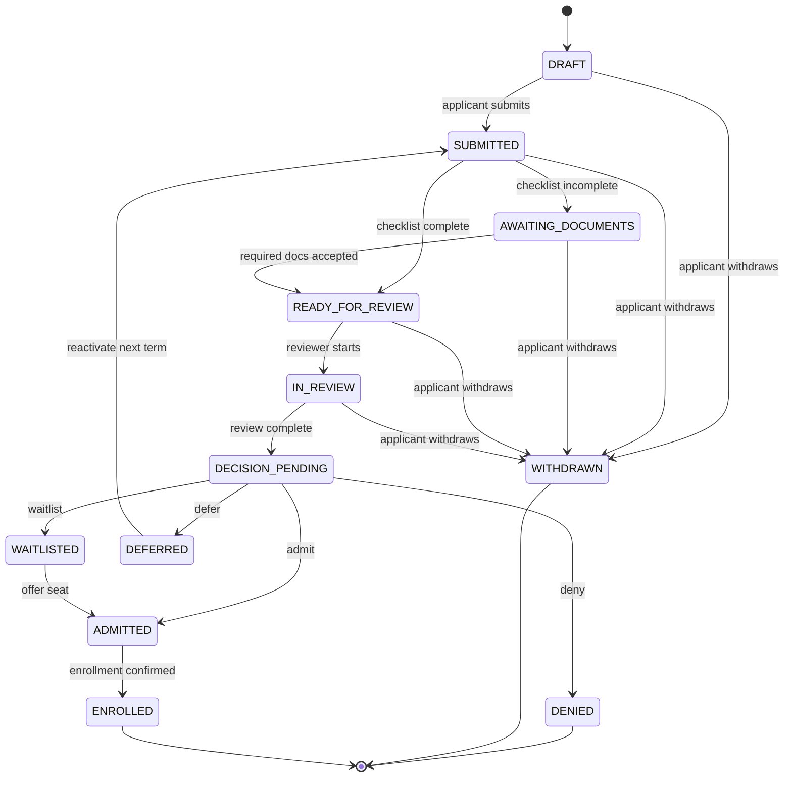
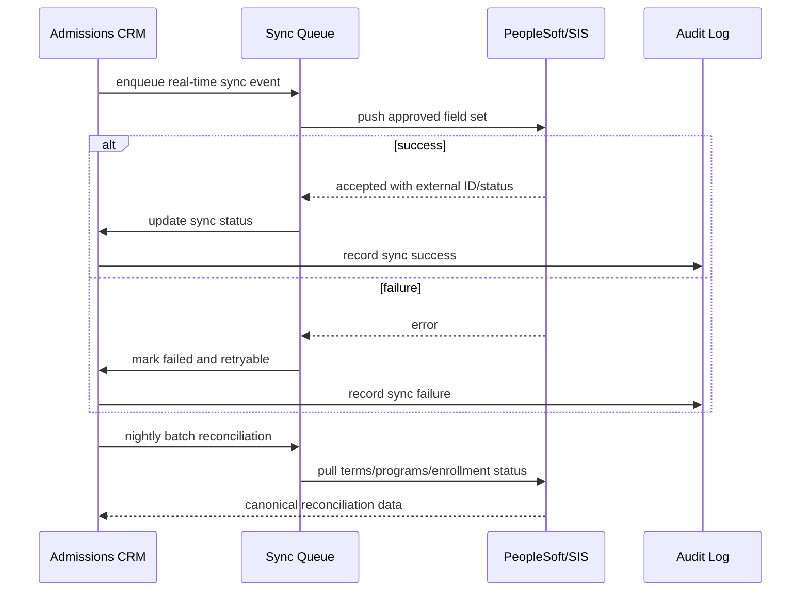
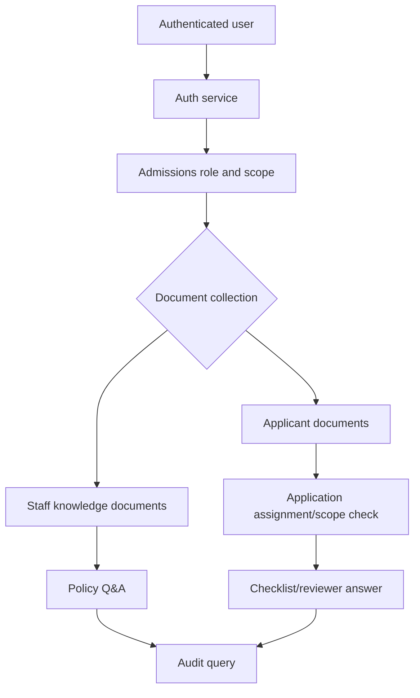

# Admissions CRM v1 Architecture and Domain Model

## Architectural Intent

Admissions CRM v1 is a bounded context focused on enrollment and admissions workflows. It should not be modeled as a generic school CRM or as a broad school operations module. The core language is `Constituent`, `Inquiry`, `Application`, `Checklist`, `Document`, `Decision`, `Campaign`, `Event`, and `SIS Sync`.

## Bounded Contexts

Rendered diagram: [`docs/diagrams/admissions-crm-bounded-contexts.svg`](diagrams/admissions-crm-bounded-contexts.svg)  
Editable diagram: [`docs/diagrams/admissions-crm-bounded-contexts.excalidraw`](diagrams/admissions-crm-bounded-contexts.excalidraw)

## Core Aggregate Boundaries

### Constituent Aggregate

Owns durable person identity and lifecycle state.

Fields:

- Legal name.
- Preferred name.
- Date of birth.
- Emails.
- Phones.
- Addresses.
- Lifecycle stage.
- Duplicate status.
- External SIS ID.

Invariants:

- A constituent must have first name, last name, date of birth, primary email, and primary phone for admissions flows.
- A constituent may have multiple applications over time.
- A constituent can be staff and applicant through shared identity links.

### Application Aggregate

Owns one program application for one term/program/application type.

Fields:

- Constituent ID.
- Academic term ID.
- Program ID.
- Application type.
- Status state.
- Assigned reviewer.
- Decision.
- Submitted timestamp.

Invariant:

- Only one active application per constituent, academic term, and program.

### Checklist and Document Aggregate

Owns admissions document collection and verification.

Document metadata is owned by CRM. File bytes are stored in object/file storage. Official archive/sync status is tracked for SIS.

### Engagement Aggregates

- `Communication` records email, SMS, and phone-call interactions.
- `Campaign` owns simple segmented campaign configuration and metrics.
- `Event` owns registration, capacity, reminders, and check-in.
- `Notification` owns in-app notification delivery.

### Analytics Integration

Google Analytics 4 (GA4) is an external analytics integration, not the admissions system of record. CRM remains authoritative for constituents, inquiries, applications, campaign audience snapshots, send audit, and provider delivery metrics. GA4 contributes web and campaign behavior metrics for reporting: source/medium/campaign attribution, page and form engagement, public event registration funnel steps, application funnel events, and aggregate conversion reporting.

The analytics boundary is privacy-first:

- No applicant PII is sent to GA4. Names, emails, phone numbers, dates of birth, documents, reviewer notes, and raw application identifiers are excluded from event parameters and URLs.
- GA4 `user_id`, when used, is an opaque CRM identifier suitable for analytics joins, not an email address or human-readable ID.
- Consent Mode v2 or an equivalent consent layer controls analytics and ads storage before GA4 tags or Measurement Protocol events are sent.
- CRM audit logs record staff actions and report/export access. GA4 event collection is separate telemetry and is not a substitute for CRM audit trails.

Recommended reporting flow:

Use the GA4 Data API for aggregate dashboard widgets and near-term campaign reports. Use BigQuery export for CRM joins, history beyond standard API windows, funnel reconstruction, and attribution analysis that combines GA4 events with CRM application state.

### Integration Aggregate

`SyncJob` and `SyncEvent` track batch and real-time PeopleSoft/SIS synchronization.

## Domain Entity Relationship

Rendered diagram: [`docs/diagrams/admissions-crm-domain-entities.svg`](diagrams/admissions-crm-domain-entities.svg)

## Application State Machine

Rendered diagram: [`docs/diagrams/admissions-crm-application-state-machine.svg`](diagrams/admissions-crm-application-state-machine.svg)  
Editable workflow diagram: [`docs/diagrams/admissions-crm-application-workflow.excalidraw`](diagrams/admissions-crm-application-workflow.excalidraw)

## SIS Sync Design

Rendered diagram: [`docs/diagrams/admissions-crm-sis-sync.svg`](diagrams/admissions-crm-sis-sync.svg)

## RAG Security Boundary

Rendered diagram: [`docs/diagrams/admissions-crm-rag-security.svg`](diagrams/admissions-crm-rag-security.svg)

Rules:

- Staff knowledge documents are role/department scoped.
- Applicant documents are application/constituent scoped.
- Applicants can query only their own application context.
- Reviewers can query only assigned applications.
- Global applicant-document search requires elevated permission and audit logging.

## Implementation Guardrails

- Keep admissions permissions action-based, not menu-based.
- Keep core identity/status/program/term/decision fields as first-class columns.
- Use custom fields only for `Constituent` and `Application` in v1.
- Batch sync must reconcile failed real-time sync events.
- Every export and applicant-document RAG query must be audited.
- Section 508 and WCAG AA are non-negotiable UI requirements.
