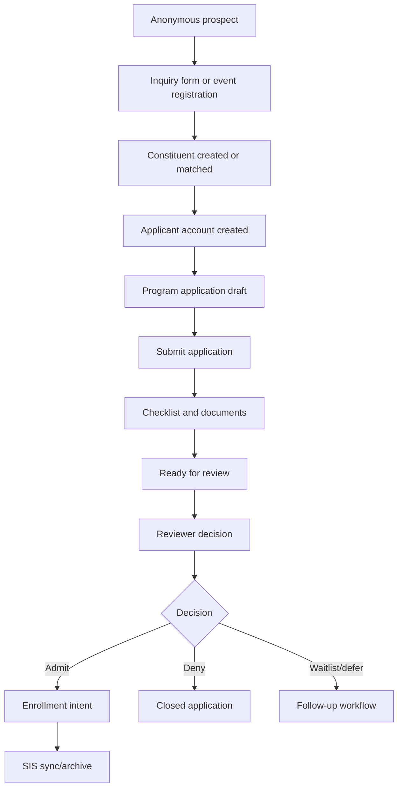

# Admissions CRM v1 PRD

## Source Material

This PRD is derived from `docs/19-002_customer_relationship_management_crm_system_full.pdf`, the CRM RFP for the Division of Student Affairs and Enrollment Management, plus the product decisions captured during the requirements grilling session.

Implementation wireframes are maintained in [`docs/admissions-crm-wireframes.md`](admissions-crm-wireframes.md) with rendered screen diagrams under [`docs/diagrams/admissions-crm-screens-png/`](diagrams/admissions-crm-screens-png/). Use those PNG diagrams as the source of truth for frontend admissions screens.

## Problem Statement

SchoolCRM needs to pivot its first CRM product slice from generic school operations to an admissions and enrollment CRM. The RFP is centered on prospective students, applicants, recruitment, admissions operations, events, communications, reporting, and PeopleSoft SIS integration. A generic school-management CRM would miss the most important domain concepts and would make later admissions workflows harder to model.

## Product Goal

Admissions CRM v1 will help admissions teams manage the prospective-student lifecycle from anonymous inquiry through application, review, document collection, decision, and enrollment handoff. The system should be cloud-hosted, secure, accessible, auditable, and built around a durable constituent identity that can later support current-student and alumni lifecycle phases.

## V1 Scope

Admissions CRM v1 is admissions/enrollment-first. It includes:

- Constituent identity and duplicate detection.
- Anonymous inquiry forms.
- Authenticated applicant portal for program applications.
- Freshman, transfer, and graduate applications.
- One active application per constituent, academic term, and program.
- Application state machine and audit history.
- Configurable required fields and document checklist items.
- CRM-managed admissions document intake and tracking until enrollment, then SIS sync/archive.
- PeopleSoft/SIS integration with a limited two-way approved field set.
- Batch-canonical sync with selected real-time events.
- Email, SMS, phone-call logging, in-app notifications, and simple segmented campaigns.
- Event registration, capacity, check-in, and automated confirmations/reminders.
- Configurable lead assignment rules and manual override.
- Rule-based lead scoring.
- Operational dashboards, role-based CSV/PDF exports, and campaign/event analytics, with Google Analytics 4 (GA4) planned as the external web/campaign analytics source.
- Staff policy RAG, applicant checklist/status assistant, and reviewer assistant released in phases with strict access boundaries.
- Cloud-hosted dev/test/prod environments.

## Out of Scope for V1

- Full school operations CRM.
- Current-student services CRM.
- Alumni engagement and advancement workflows.
- Full configurable workflow engine.
- Full drag-and-drop form builder.
- Full custom report builder.
- Full campaign journey builder, A/B testing, print campaigns, and advanced multi-touch attribution beyond the GA4 integration boundary defined below.
- Event payments, discount rules, staff scheduling, expense tracking, waitlists, and event task checklists.
- Full two-way SIS sync for all fields.
- Full multi-tenant SaaS platform.
- Full payment gateway beyond application fees.
- Formal VPAT generation unless procurement requires it.

## Primary Users

- Anonymous prospect.
- Authenticated applicant.
- Recruiter / admissions counselor.
- Application reviewer.
- Admissions administrator.
- Marketing manager.
- Event manager.
- Report viewer.
- System administrator.

## Core Decisions

### Product Boundary

V1 is an admissions/enrollment CRM first. Broader school operations are later-phase.

### Root Identity

The root identity is `Constituent`, not `Student`. A constituent can move through lifecycle stages:

- `PROSPECT`
- `INQUIRY`
- `APPLICANT`
- `ADMITTED`
- `ENROLLED`
- `ALUMNI`

### Application Unit

The v1 application unit is a program application. A constituent can have multiple applications over time, but only one active application per academic term and program.

### Application Types

V1 supports:

- `FRESHMAN`
- `TRANSFER`
- `GRADUATE`

### Application Status

Application status is a state machine, not a loose enum. Every transition records actor, timestamp, reason/note, and audit metadata.

Initial states:

- `DRAFT`
- `SUBMITTED`
- `AWAITING_DOCUMENTS`
- `READY_FOR_REVIEW`
- `IN_REVIEW`
- `DECISION_PENDING`
- `ADMITTED`
- `DENIED`
- `WAITLISTED`
- `WITHDRAWN`
- `DEFERRED`
- `ENROLLED`

### Documents

CRM collects and tracks admissions documents until enrollment, then syncs/archives to SIS. Document statuses include:

- `UPLOADED`
- `PENDING_REVIEW`
- `ACCEPTED`
- `REJECTED`
- `WAIVED`
- `EXPIRED`
- `SYNCED_TO_SIS`

### Duplicate Detection

Duplicate detection uses exact-match rules plus a fuzzy duplicate review queue.

Required v1 identity fields:

- First name.
- Last name.
- Date of birth.
- Primary email.
- Primary phone.

Trusted exact matches can auto-link only when supported by verified email, external SIS ID, or portal account. Fuzzy matches require staff review.

### SIS Integration

PeopleSoft/SIS owns programs and academic terms. CRM read-only syncs them and may add local display metadata.

Integration is two-way for a small approved field set:

CRM to SIS:

- Constituent identity updates.
- Application submission.
- Application decision.
- Document checklist status.
- Admission/enrollment intent.

SIS to CRM:

- External SIS ID.
- Academic terms.
- Program catalog.
- Existing person matches.
- Enrollment status.
- Official hold/status signals.

Batch sync is canonical. Real-time sync is used for selected events such as application submission, decision posted, document accepted/rejected, and enrollment intent confirmed.

### Communications and Campaigns

V1 supports email, SMS, phone-call logging, transactional messages, individual staff messages, in-app notifications, and simple segmented campaigns.

V1 segmentation can use:

- Application type.
- Application status.
- Academic term.
- Program.
- Event attendance.
- Lead score band.
- Assigned recruiter.
- Geography/territory.

Campaign metrics have two sources of truth:

- CRM owns campaign configuration, audience snapshots, send audit, and email/SMS provider metrics such as sent, delivered, opened, clicked, bounced, and replied.
- GA4 owns anonymous/web analytics signals such as source/medium/campaign attribution, landing page activity, inquiry form engagement, event registration funnel activity, and downstream conversion events when consent allows.

V1 must not send applicant PII (name, email, phone, date of birth, application IDs containing PII, or free-text admissions notes) to GA4. If user identity is needed for reporting joins, GA4 uses an opaque CRM user or constituent identifier only. CRM remains the authoritative admissions record; GA4 is a supplemental analytics source for campaign and report views.

GA4 event naming uses `snake_case` and a small event taxonomy with parameters rather than many one-off event names. Initial events include `generate_lead`, `form_submit`, `campaign_click`, `event_registration_started`, `event_registration_completed`, `application_started`, `application_submitted`, and `enrollment_intent_confirmed`. UTM parameters are normalized at intake (`utm_source`, `utm_medium`, `utm_campaign`, `utm_content`, `utm_term`) and lowercased where appropriate to avoid fragmented reports.

Browser collection uses the Google tag through one approved client tagging path: Google Tag Manager for low-code tag governance, or `gtag.js` when direct application-managed tagging is simpler. The selected path must initialize consent defaults before analytics events, centralize event pushes through a typed application analytics facade, and keep destination IDs/configuration environment-specific. If Google Tag Manager is selected, the facade owns the `dataLayer` event contract so GTM configuration can change without leaking tag-specific logic into Angular components. Server-side/offline events such as email clicks from provider webhooks, application submission, admission decision, and enrollment intent may be sent to GA4 through Measurement Protocol or a server-side Google Tag Manager container after consent and PII checks. Embedded CRM reports use the GA4 Data API for aggregate dashboard widgets and BigQuery export for CRM-to-GA joins, long-range history, and advanced analysis.

### Events

V1 events support online registration, capacity, attendance check-in, and automated confirmations/reminders.

### Lead Assignment and Scoring

Lead assignment uses configurable rules plus manual override. Assignment criteria can include territory, program interest, application type, academic term, lead source, event attendance, and last-name alpha range.

Lead scoring is simple and rule-based. Score bands are:

- `COLD`
- `WARM`
- `HOT`
- `READY_TO_APPLY`

### Roles and Access

Global auth roles remain:

- `SUPER_ADMIN`
- `SCHOOL_ADMIN`
- `TEACHER`
- `STUDENT`
- `PARENT`

Admissions CRM roles are context-specific:

- `ADMISSIONS_ADMIN`
- `RECRUITER`
- `APPLICATION_REVIEWER`
- `MARKETING_MANAGER`
- `EVENT_MANAGER`
- `REPORT_VIEWER`
- `APPLICANT`

Global roles get a user into the platform. Admissions roles control admissions actions.

### Applicant Portal

Anonymous users can submit inquiry forms, register for public events, request information, and start account creation. Applications, uploads, fees, and status tracking require authenticated applicant accounts.

Applicants and staff share the same identity table, with different profile/role contexts.

### Forms and Custom Fields

Application forms are mostly fixed, with configurable required fields and checklist items.

Custom fields are supported for `Constituent` and `Application` only in v1. Custom fields must be usable in search, filtering, reports, imports/exports, campaign segmentation, and workflow/routing rules.

### Imports and Exports

Imports support CSV and Excel for constituents/prospects, inquiries, applications, event registrations, and campaign audience lists.

Exports support role-based CSV and PDF. Exports are audit-logged, scope-limited, and permissioned.

### RAG

RAG indexes staff knowledge documents and applicant documents with strict collection and authorization boundaries.

Release order:

1. Staff-only policy/knowledge Q&A.
2. Applicant checklist/status assistant.
3. Reviewer assistant over assigned applicant files.

### Audit

V1 audits security-sensitive actions and admissions workflow changes, including login failures, role changes, data exports, document activity, application transitions, decisions, duplicate merges, SIS sync activity, RAG queries over applicant documents, and custom field definition changes.

### Compliance, Availability, and Deployment

- Accessibility target: Section 508 + WCAG AA.
- Availability target: 99.5% monthly uptime.
- RPO: <= 24 hours for full database restore.
- RTO: <= 8 business hours for service restoration.
- Backups: daily automated backups.
- Recovery drills: at least quarterly before production, semiannual after production.
- Deployment: cloud-hosted dev/test/prod environments.

## High-Level User Journey

Rendered diagram: [`docs/diagrams/admissions-crm-user-journey.svg`](diagrams/admissions-crm-user-journey.svg)

## V1 Success Metrics

- Inquiry-to-application conversion can be tracked by source, campaign, program, and term.
- GA4-backed reports can attribute inquiry and application funnel activity by normalized UTM source, medium, campaign, content, and term without exposing applicant PII to GA4.
- Applications can be submitted, reviewed, decided, and audited end-to-end.
- Duplicate candidates are surfaced before creating conflicting constituent records.
- Staff can see application status and document bottlenecks.
- Applicants can save and return to complete applications.
- Admissions staff can export role-scoped reports in CSV/PDF.
- SIS sync failures are visible and actionable.
- Staff policy RAG can answer from scoped knowledge documents with citations.
