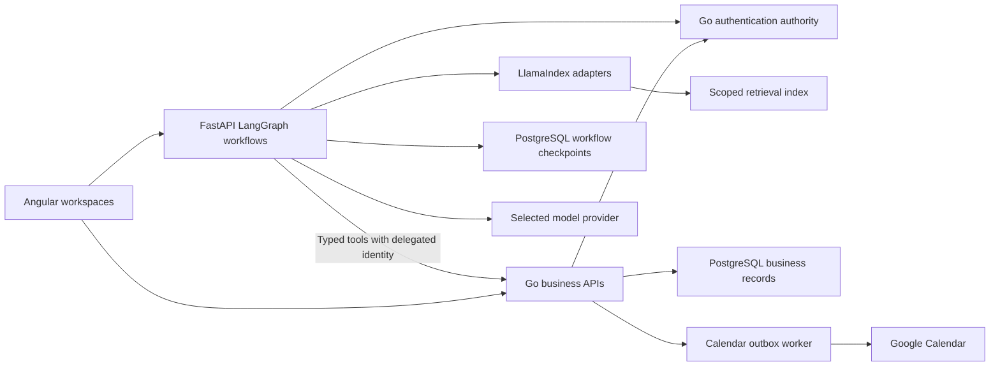

# School AI architecture requirements document

Status: proposed implementation requirements with confirmed product decisions. This document does not claim the features are deployed.

Date: 2 October 2026. Delivery owner: Beads epic `schoolCRM-o58`. Documentation bead: `schoolCRM-o58.10`.

## Purpose and authority

Extend SchoolCRM with lesson planning, curriculum retrieval, student advice and school operations in the existing Go, Angular and Python application. This ARD covers the eight feature beads under the epic. Beads owns task status; this document owns the architecture requirements for their implementation.

Confirmed decisions take precedence over older proposal text. The selected stack is Angular, Go and FastAPI, with LangGraph orchestration and LlamaIndex retrieval. The curriculum scope is Kenya CBC/CBE and legacy 8-4-4, Playgroup through secondary, plus Cambridge Early Years through Year 9. Higher Cambridge years are future work. Google Calendar is the initial calendar provider.

Every lesson version follows teacher submission, Head of Department review, dean approval and teacher publication. This includes the initial version. Changed content requires fresh review and approval. Published snapshots remain immutable and available while a new draft proceeds through the same workflow.

Confirmed on 2 October 2026: the author, HOD reviewer and dean approver must be three different people. `SUPER_ADMIN` delegates school membership management to users with the `SCHOOL_ADMIN` role. A delegated administrator manages only their assigned school; only `SUPER_ADMIN` may grant or revoke that delegation. [School access API](school-access-api.md) defines the prerequisite membership contract under `schoolCRM-o58.4.1`. [Lesson publishing API](lesson-publishing-api.md) defines the `schoolCRM-o58.4` workflow. Each save creates an immutable version, and lesson content is a bounded JSON object until `.3` confirms the schema.

## Existing implementation and evidence

The implementation baseline is `origin/develop` at commit `1bc93eb` when this ARD was written. Earlier School AI design work on `feature/architecture-docs` and the confirmed Beads notes inform requirements, but are not evidence that the proposed features exist on `develop`.

| Existing component | Evidence | Implementation implication |
| --- | --- | --- |
| Authenticated Angular application | [Application routes](../api/frontends/web-admin/src/app/app.routes.ts) | Extend existing workspaces and guards |
| User APIs | [User routes](../app/domain/userapp/route.go) | Reuse identity and account management; add scoped responsibilities where required |
| Authentication shared with Python | [RAG auth client](../api/services/RAG/infrastructure/auth_client.py) | Reuse the Go auth authority and its JSON:API response |
| General RAG scaffold and admissions adapters | [RAG assembly](../api/services/RAG/infrastructure/dependencies.py) | General ingestion/search still uses no-op and in-memory adapters; admissions has optional Neo4j and Ollama adapters. Neither proves production curriculum retrieval |
| Deterministic Kenyan admissions calculations | [Admissions values](../business/domain/admissionsbus/values_ke.go) | Verify authoritative rules and reuse fitting calculations; label estimates |
| Local infrastructure | [Compose definition](../zarf/compose/docker_compose.yaml) | Assess the actual services and storage before selecting new infrastructure |
| Existing system design and delivery | [Admissions architecture](admissions-crm-architecture.md), [local development](local-development.md), [Git hooks](git-hooks.md) | Preserve domain layering and run affected repository gates |

Trace the current branch before implementation. Existing admissions events, reports and permissions do not establish teaching sessions, attendance/exam reporting or scoped HOD/dean authority.

## Runtime ownership

| Layer | Owns | Boundary |
| --- | --- | --- |
| Angular | Role-aware workspaces, chat, citations, forms, approval cards and recovery | UI visibility supports usability; backend checks authorise each action |
| Go | Memberships, capabilities, business writes, lesson versions/publication, qualification calculations, scheduling conflicts, aggregates and audit | Extend `app/domain`, `business/domain` and domain stores; all business mutations go through this layer |
| FastAPI and LangGraph | Bounded student, teaching and operations workflows, private threads, resumable runs and approval requests | Authenticate each request and resume; call allowlisted Go tools with delegated user authority |
| LlamaIndex adapters | Parsing, indexing and retrieval of approved evidence | Preserve framework-free domain types; enforce trusted filters before model exposure |
| PostgreSQL and controlled file storage | Business records, source revisions, original files, retrieval metadata and durable runs | Separate business records from Python indexes/checkpoints; protect credentials and private files |
| Model provider | Grounded text and schema-validated draft generation | Model output cannot grant permissions, approve writes or establish official qualification rules |

Use the existing Python service rather than creating a service per agent. Reuse existing admission graph adapters where suitable; a new graph database is not required solely for curriculum search. PostgreSQL with pgvector is the selected curriculum retrieval direction, subject to extension provisioning and persistence tests. Confirmed on 3 October 2026: BGE embeddings use local Ollama in development and Cloudflare Workers AI in production; DeepSeek generates text. BGE-M3 is the multilingual variant selected for the acquisition record, using `bge-m3` and `@cf/baai/bge-m3`. Pin model identity and validate dimensions and provider compatibility before indexing. The exact DeepSeek model/endpoint and permitted student-data handling remain open. [Curriculum acquisition](CurriculumData/README.md) records downloaded sources and access failures.

Temporal, Asynq, Casbin, SQLC and Maroto are candidates only. Add a dependency when existing components cannot meet a demonstrated requirement. Retain complete lesson snapshots; there is no current requirement for delta storage.

## Shared contracts and invariants

### Identity and school isolation

- Go remains the identity authority. Resolve school, department, class and resource access from trusted membership/capability data. Client parameters and model text do not grant scope.
- Deny unauthorised reads and writes at the backend, including source files, history, exports, student records, calendar integrations and private threads. Retrieval filters apply before any content reaches a model.
- Represent HOD review and dean approval as scoped capabilities or memberships. A global role label alone is insufficient.
- Revalidate authority when a run resumes or a proposed command executes. Permission changes invalidate previously sufficient authority.
- Keep bearer tokens, OAuth credentials and provider secrets out of model prompts, checkpoints, citations and logs. Use protected credential storage and fresh delegated authority on resume.

### Business APIs and assistant events

Go handlers registered through `foundation/web` use JSON:API v1.1 through the central response pipeline. Success documents contain `jsonapi.version = "1.1"` and `data`, with `Content-Type: application/vnd.api+json`. Errors contain `errors`, with a client-safe message in `errors[0].detail`. Angular and Python tool adapters unwrap single-resource `data.attributes`, collection `data` and `meta`, and failure details.

The assistant needs an explicit SSE contract separate from Go business responses. Before UI integration, define typed progress, citation, approval-request, structured-result and terminal-error events. Each run must have a terminal outcome; reconnects must preserve ownership and avoid repeating writes. Final event names, versioning and reconnect semantics belong in the implementation contract.

Write proposals bind the actor, exact payload, resource IDs, expected versions and required approvers. Approval is necessary where the workflow requires it. Go rechecks permissions, versions and conflicts at execution. Persist idempotency keys and execution receipts so retries cannot duplicate publication, enrolment or appointments. Retrieved documents cannot register tools or authorise commands.

### Persistence and concurrency

Store complete immutable lesson versions, source/rule revisions and auditable execution outcomes. Enforce unique version numbers per plan. Create a version and update its current pointer in one transaction. Use optimistic concurrency to reject stale edits instead of silently overwriting them.

Published content references an exact immutable version. Track draft/review state separately from the live publication pointer so a new draft cannot take down the published version. Protect history from incidental cascade deletion. Define retention and deletion policy before enabling destructive history operations.

Persist LangGraph runs, thread ownership and pending approvals in PostgreSQL. Python may write its indexes and checkpoints; it must not write Go-owned school records directly. Use atomic business transactions and a durable outbox for external calendar writes. Test recovery from ambiguous provider timeouts.

## Feature requirements and acceptance

### `schoolCRM-o58.1`: Lesson-planning frontend and admin user management

Extend the Angular application with teacher lesson creation, editing, reuse, submission and publication views, plus HOD/dean review queues. Display the exact version, evidence, approval history and current live publication. Provide role-aware assistant threads, citations, structured cards, loading/failure states and reconnect recovery.

Reuse existing user management for permitted account and role operations. Add school/department memberships and teaching assignments through authorised APIs. Confirm existing invitation behaviour before presenting it as available. UI actions must reflect server permissions and accessible keyboard/focus behaviour.

Acceptance: teacher, HOD and dean journeys run against real APIs; stale versions produce visible conflicts; unauthorised controls and direct API attempts fail; private threads remain private. This bead depends on backend contracts from `.3` and `.4`; retrieval and generation views also depend on `.2`.

### `schoolCRM-o58.2`: Curriculum ingestion, retrieval and semantic search

Authorised staff upload supported resources with checksums, authority, framework, stage/year, subject, topic, revision and access scope. Preserve original files and page/record references. Parse/OCR uncertain content for review; only approved, active revisions enter retrieval. Withdrawn revisions become ineligible without deleting required historical citations.

Use LlamaIndex adapters and a durable scoped index. Enforce school/access/framework/stage/subject/revision filters at the retrieval boundary. Record embedding model identity, dimensions and index revision. Keep Kenya frameworks and Cambridge distinct; equivalence requires an authoritative mapping. Supplied admissions data is not curriculum evidence.

Acceptance: authorised queries retrieve known curriculum evidence with correct citations; cross-school, wrong-framework and withdrawn content never reaches the model; unsupported questions abstain; restart preserves approved sources and indexes. Actual authorised curriculum files and embedding/provider decisions are prerequisites for end-to-end validation.

### `schoolCRM-o58.3`: Structured lesson generation and versioned storage

Retrieve approved curriculum evidence and validate generated output against an agreed lesson schema. The proposed schema includes objectives, prerequisites, materials, timed activities, differentiation, assessment and citations. Curriculum-specific required fields and duration constraints need confirmation before the schema becomes final.

Go stores plans and complete immutable versions with school/department/class ownership, framework/revision, source references, model metadata, author and change summary. Support human editing, retrieval, reuse and duplication. Creating a reused plan preserves provenance but does not copy publication approval.

Acceptance: invalid model output cannot become a valid stored plan; concurrent edits reject stale versions; version numbers are unique; saving cannot leave a new snapshot without its pointer update; edits leave earlier published content unchanged. Generation depends on `.2`; persistence and publication contracts must align with `.4`.

### `schoolCRM-o58.4`: Lesson access control and publishing

Go enforces this version-specific lifecycle:

```mermaid
stateDiagram-v2
    [*] --> Draft
    Draft --> HODReview: Teacher submits version
    HODReview --> DeanApproval: HOD reviews
    HODReview --> ChangesRequested: HOD requests changes
    DeanApproval --> Approved: Dean approves
    DeanApproval --> ChangesRequested: Dean requests changes
    Approved --> Published: Teacher publishes exact version
    ChangesRequested --> Draft: Teacher creates revised version
    Published --> Draft: Teacher creates new version; publication stays live
```

Submission fixes the reviewed version's content. Revising content creates a new version with no inherited approvals. HOD and dean decisions bind the exact version. Publication checks the teacher's current authority and both approvals in the same business operation. Store actor, decision, version, time and feedback in audit history.

Acceptance: direct teacher publication without HOD/dean decisions fails, including the initial version; another school/department cannot review or publish it; editing invalidates the revised version's approval eligibility; duplicate publication is harmless; previous published content stays live. Scoped membership and version persistence are prerequisites. The author, HOD reviewer and dean approver must be three different people, even if one user holds multiple capabilities.

### `schoolCRM-o58.5`: Admissions graph evidence and programme mappings

Review scanned PDF claims against original pages and resolve the eight flagged extraction cells recorded in the existing data-review task without inventing values. Verify CSV authority, applicable cycle and undated cluster points. Approve explicit mappings across programme sources and record provenance, reviewer and rule revision.

Separate historical cutoffs, minimum entry requirements and executable calculation rules. Unreviewed claims and ambiguous mappings cannot determine qualifications. Keep architecture proposals outside student evidence collections.

Acceptance: reviewed claims trace back to original pages/records; disputed or undated claims remain visibly unresolved; approved programme mappings and calculation rules have authoritative revisions. This is a prerequisite for executable admissions advice in `.6`.

### `schoolCRM-o58.6`: Student qualification evaluation and school Q&A

Students enter results or upload transcripts, then confirm extracted subjects and grades. Identify qualification system and admissions cycle explicitly. Go evaluates reviewed rules deterministically and returns the input values, selected subjects, formula, comparison and rule revision for each programme.

Distinguish minimum eligibility from admission/placement. Return eligible, ineligible or insufficient evidence as supported by reviewed rules. Label estimates separately from official values. Unsupported systems or uncertain OCR require clarification; model inference cannot supply missing grades or official points.

Answer school questions from approved, published documents with source citations and revision dates. Abstain when evidence is absent or unsuitable. Restrict private student records to authorised viewers.

Acceptance: independent subject/grade fixtures match the deterministic breakdown; missing/ambiguous inputs return insufficient evidence; eligibility does not promise placement; unsupported answers abstain; another student's private data is inaccessible. Depends on `.5`, authoritative calculation rules and scoped retrieval.

### `schoolCRM-o58.7`: Classes, timetable, reporting and calendar agents

Go owns classes/sections, enrolments, teacher assignments, rooms and sessions. Support timetable creation, rescheduling and cancellation with timezones and exceptions. Preview the affected records and obtain required approval. Recheck teacher, room and student-group conflicts transactionally when committing, including simultaneous requests.

Record/import attendance and assessment results through authorised APIs. Go computes class/term/date aggregates; AI narratives may describe returned aggregates but cannot invent totals. Reports show the period, source data and access scope. CSV/PDF outputs preserve these checks. Clarify the user's term "cut" and record/import rules before defining that report.

Integrate Google Calendar using user OAuth consent. Support availability, recurrence, attendees, timezones and create/update/cancel within granted access. Store internal/provider IDs, command keys and pending/failed/succeeded sync state. An outbox worker retries safely and reconciles uncertain results. Recheck provider quotas, pricing and account licensing before deployment. Nextcloud/CalDAV remains an alternative, not a second v1 provider.

Acceptance: conflicting simultaneous bookings allow at most one commit; stale approved changes fail; reports reconcile with independently computed records; repeated calendar timeout/retry creates no duplicate event; consent revocation and provider failures produce recoverable visible states. Teaching records, membership and approved-command contracts precede agent integration.

### `schoolCRM-o58.8`: Lesson PDF export and production validation

Export a selected authorised lesson version with curriculum references, version identity and publication status. Rendering must not modify content or imply a draft is published. Reuse an existing renderer if it meets layout, accessibility and operational requirements; Maroto is not preselected.

Validate durable workflows, backups, restore, model/index compatibility and safe migrations. Measure latency and reliability under an agreed workload before committing to the blueprint's targets. Evaluate existing deployment and Kubernetes configuration before adding queues or scaling mechanisms.

Acceptance: export matches the selected snapshot and rejects unauthorised access; service restart resumes approved workflows without repeating writes; restore recovers business records, source files and checkpoints; performance results identify workload and limits. Depends on `.3`/`.4`; integrated production readiness also depends on the other delivered features.

## Delivery order and release proof

Beads may show a feature as ready when it has no recorded blockers. That does not remove the behavioural prerequisites described here. Confirm prerequisites and record actual dependencies in Beads before claiming implementation work.

Start with scoped access and the lesson version/publication foundation across `.3` and `.4`, in independently testable beads where necessary. Review evidence in `.5` and obtain curriculum resources for `.2`. Add `.1` after backend contracts stabilise, and `.6` after admissions rules are reviewed. Build teaching records before the `.7` agents. PDF export follows authorised versions; integrated reliability proof follows the delivered workflows.

For each bead, apply the Git Flow, quality-gate, thermo-nuclear review and PR requirements in [AGENTS.md](../AGENTS.md). Documentation delivery leaves the eight implementation beads open. Record a PR URL and validation evidence before closing a completed bead; merging remains separate.

The release needs real student, teacher, HOD, dean and admin browser journeys against Go and Python services. Include hostile document instructions, revoked roles, cross-school requests, concurrent edits/bookings, interrupted runs, provider timeouts and backup restoration. Run the existing affected Go, Angular and Python gates. A chat demonstration alone does not prove these requirements.

## Decisions required before dependent implementation

| Decision or input | Affected work | Completion condition |
| --- | --- | --- |
| Authorised curriculum files and revision metadata | `.2`, generation in `.3` | Cambridge IGCSE PDFs acquired; KICD downloads unavailable. Review revisions and confirm IGCSE scope; obtain authorised KICD originals |
| Final lesson schema and duration rules | `.3`, `.1`, `.8` | Confirm fields and validation per curriculum |
| Class assignment administration | `.1`, `.7` | Confirm how teaching assignments bind class access; school management delegation and three-person lesson approval are confirmed |
| Model setup and permitted student-data handling | `.2`, `.3`, `.6`, assistant runtime | Ollama BGE for development, Cloudflare Workers AI BGE for production and DeepSeek confirmed. Pin model IDs/digests, credentials and index metadata; confirm private-data policy |
| Admissions authority, applicable cycles, programme mappings and cluster rules | `.5`, `.6` | Reviewed evidence supports deterministic evaluation |
| Report semantics, including "cut", and attendance/exam inputs | `.7` | Agree definitions, periods and record/import rules |
| Retention/deletion, recovery and measurable service targets | `.8` and destructive operations | Define policy, workload and restore objectives |

V1 excludes voice, arbitrary SQL/code tools, autonomous privilege escalation, automatic curriculum equivalence, multiple calendar/model providers and automatic whole-school timetable optimisation. Ordinary timetable changes, appointments and the confirmed approval lifecycle remain in scope.
